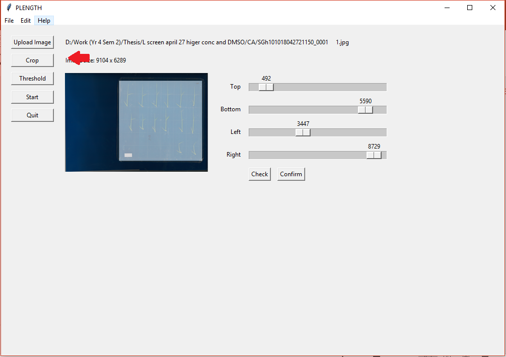
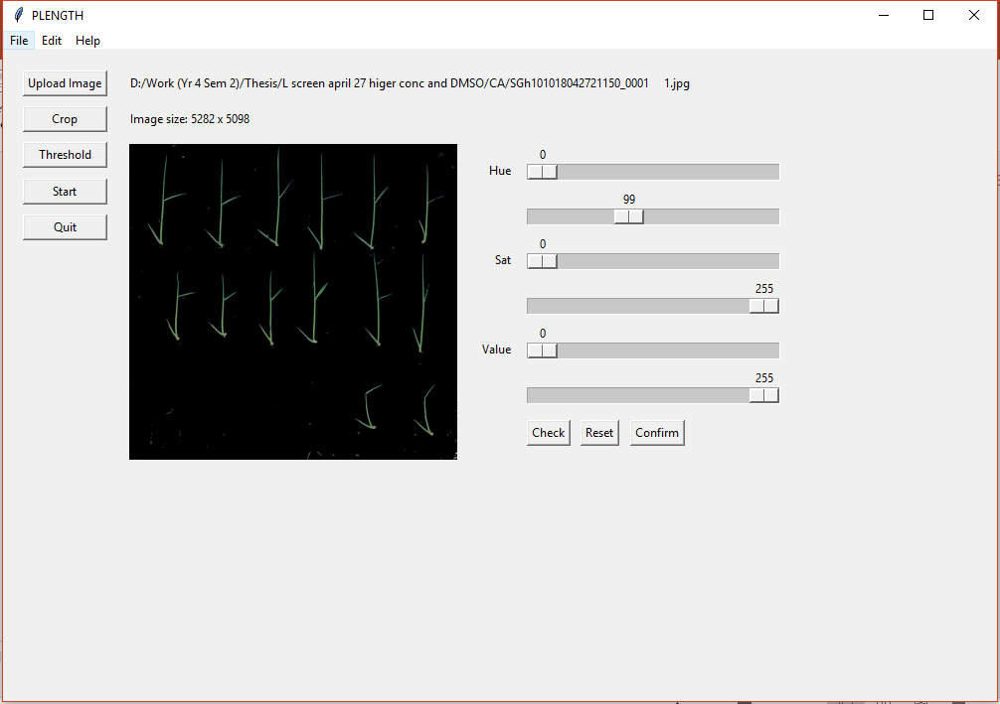
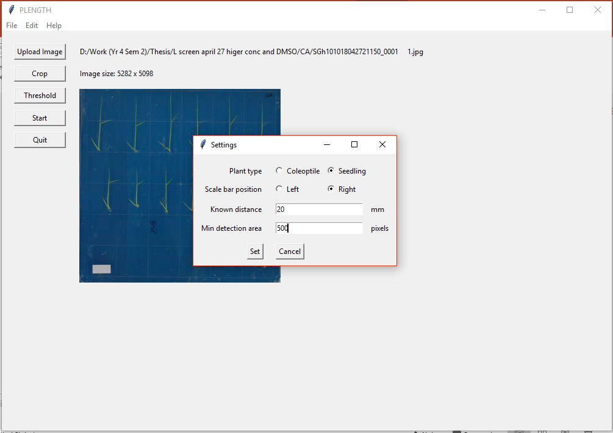
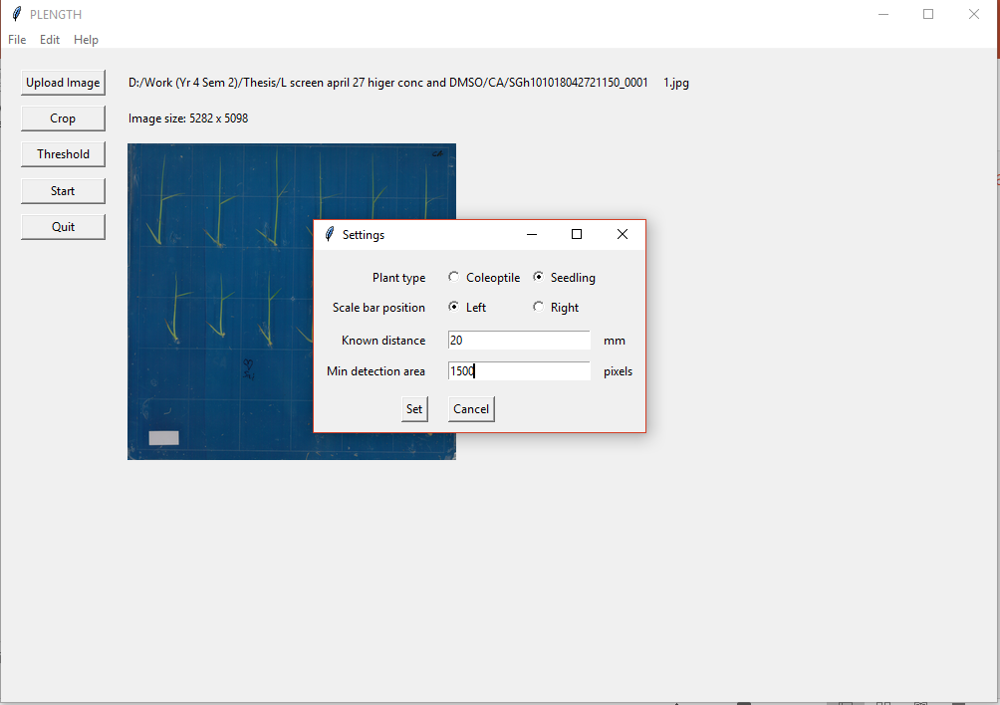
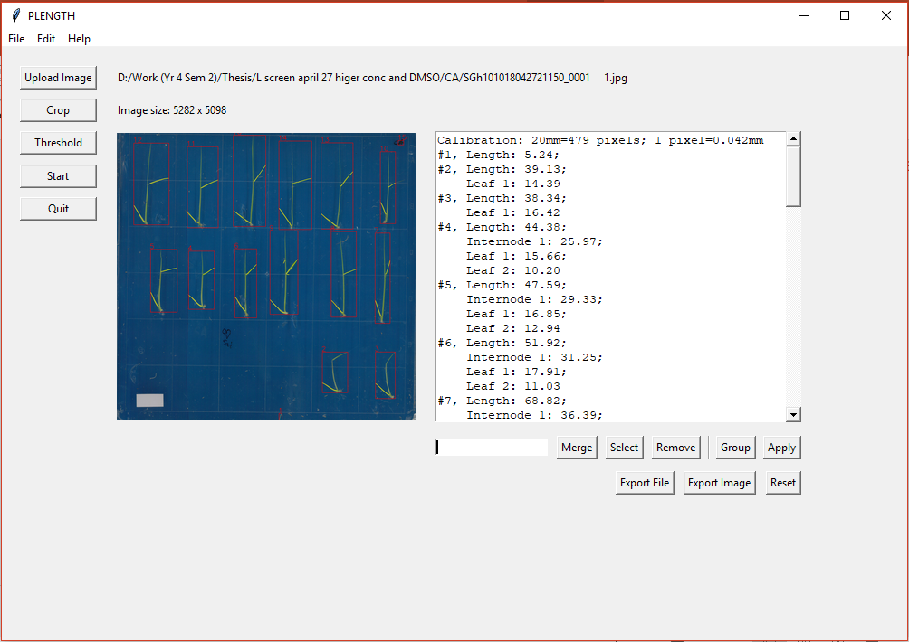

# Plength
#### Python script for the automated analysis of rice seedlings

Plength has been developed during my Bachelor's thesis in 2018. It is essentially a self-contained script which also includes a GUI. The program measures the total length, leaf lengths and internode length of rice seedlings. Here is what you will see after a successful analysis.

It is also possible to measure coleoptiles, and functionalities like grouping and merging measurements also exist (see further).

### How to install

Plength was written with Python 3.5.2. (installed using Anaconda 2.4.1). To use the program, the following libraries need to be installed. **It is recommended that the same versions be used as listed below, as the program does not work with newer versions of OpenCV, numba, or NetworkX.**
- NumPy 1.14.1
- OpenCV 3.1.0
- NetworkX 1.10
- skimage 0.13.1
- SciPy 1.0
- numba 0.37.0
- sknw last updated on Oct 25, 2017 (https://github.com/yxdragon/sknw)

Once the libraries have been installed, simply download the file "PLENGTH.py" and run the script.

### Input specifications
For optimum performance, the following conditions are recommended:
- Scanned image, 600 dpi
- A black background for coleoptiles or a blue background for seedlings
- The plate contains no scratches and smudges; ideally it would also be gridless
- No overlapping plants
- The scale bar is a white strip of known length placed on either the lower right or left corner of the plate
- No plant is in the same grid box as the scale bar (~3cm for gridless plates)

Sample input files can be downloaded in the folder "sample-input/"

### Steps

1. Upload a scanned image of coleoptiles or seedlings on a plate. 

2. Crop the plate borders and surrounding areas.

3. For seedlings, check if your plants are being detected using the Threshold button. Adjust values accordingly.

4. Check the settings to see that the plant type being analyzed and scale bar position and length are correct.

Changing scale bar position and increasing minimum detection area to remove noise (optional).

5. Run the program. Each detected region will be labeled with a red bounding box and a number. In case of seedlings, yellow lines are drawn over the branch determined to be a leaf. This could be incorrect if the leaf is too close to the main stem.

6. Merge, remove, select, or group regions as necessary. The labeled image can be exported to see the numberings more clearly. The mean, standard deviation, and standard error will be recalculated for each parameter.

7. Export to a csv file.

## Other functionalities
### Grouping treatments
Plants under different treatments can be grouped together. Clicking the grouping button puts the result in grouping mode (indicated by the first sentence "Please enter asterisks between groups"). While in grouping mode, type asterisks (\*) in a new line to separate the plants into groups. You can shift the rows around (Ctrl+X then Ctrl+V) and even remove them during grouping. Click "Apply" to create the groups, and the statistics will be calculated for each group. If you wish to ungroup them, go into the grouping mode, remove the group heading(s), then click apply.

### Selecting and removing plants
Type the number(s) of plant(s) you want to select or remove in the entry box. Separate the numbers with a comma (no space in between). A range of numbers will also be accepted. For example, to remove plants number 1, 4, 5, 6, and 10, type "1,4-6,10" and click "Remove." Selection and removing can be done after grouping, and the statistics will be recalculated accordingly.

### Merging
Sometimes, the program will detect one plant as two. When that happens, two or more results can be merged by typing plant1+plant2 in the entry box, e.g. "4+17" will merge plants 4 and 17. Separate each merging with a comma (no space in between). Merging can only happen once, so first typing "4+17" then "4+17+23" will not work - to merge three plants you have to include all the numbers at once. Only plants from the same group can be merged.

Merging leaf values is a little more complicated. You will have to use the letter "l" to indicate the leaf, followed by the leaf number. (Leaves are numbered from bottom to top.) For instance, if the second leaf of plant 4 was cut off and the stray leaf was numbered as 8, you have to type "4l2+8" to merge them. Always make sure that the main plant is the first value (i.e. before the plus sign).

### Measuring coleoptiles
For coleoptiles, all the steps are exactly the same with the exception that the "Threshold" option is not available. Make sure to click "Coleoptile" in the settings before starting the analysis!
